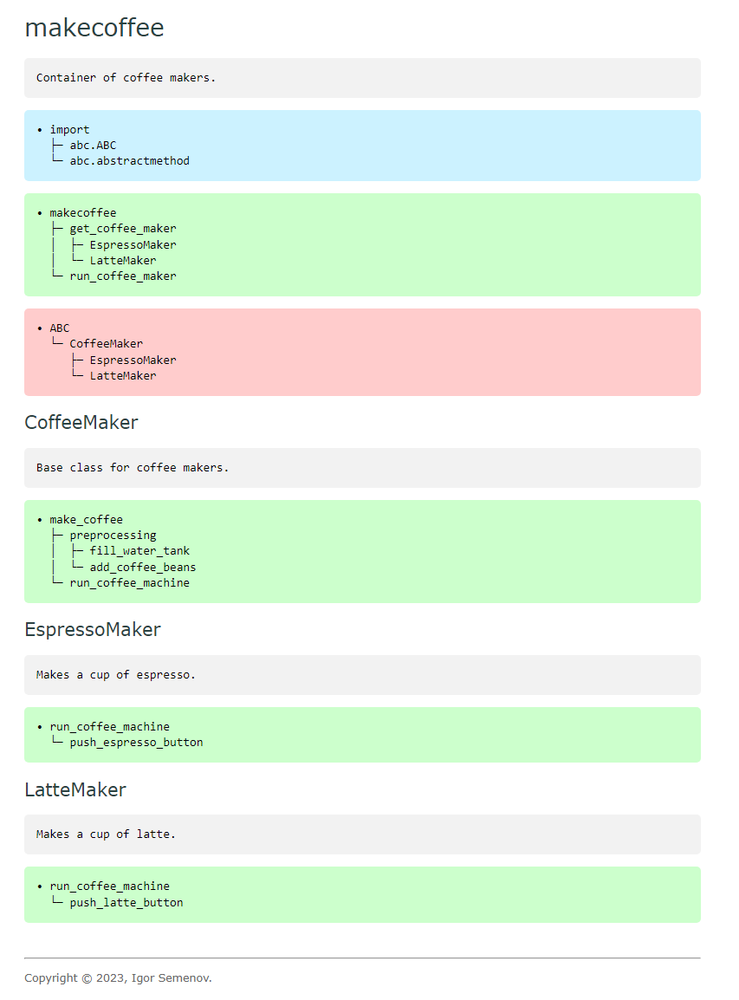

[](https://github.com/pylint-dev/pylint)
[](https://opensource.org/licenses/BSD-3-Clause)

#  docspyer

Explores the structure of your Python code.

## Features

- Relies on static code analysis.
- Reports on call trees and class trees.
- Supports HTML and Markdown (MD) output formats.
- Includes a simple documentation generator as a bonus.

## Install

The package is small enough to be used without pre-installation:

- Download the package and add its location to `sys.path`.
- After that import the package as usual — <code><b>import</b> docspyer</code>.

## Documentation

See the [documentation](docs/sources/index.md) for more details, in particular:

- [Usage](docs/sources/usage.md)
- [Reference](docs/sources/docspyer.md)

## Example

Shown below is a report on the [makecoffee](#code) module.

### Report



### Code

<b>makecoffee.py</b>

```python
# -*- coding: utf-8 -*-
"""Container of coffee makers.
"""

from abc import ABC, abstractmethod


def makecoffee(drink):
    maker = get_coffee_maker(drink)
    run_coffee_maker(maker)


def get_coffee_maker(drink):
    if drink == 'espresso':
        return EspressoMaker()
    if drink == 'latte':
        return LatteMaker()
    return None


def run_coffee_maker(maker):
    maker.make_coffee()


class CoffeeMaker(ABC):
    """Base class for coffee makers.
    """

    def make_coffee(self):
        self.preprocessing()
        self.run_coffee_machine()

    def preprocessing(self):
        self.fill_water_tank()
        self.add_coffee_beans()

    def fill_water_tank(self):
        pass

    def add_coffee_beans(self):
        pass

    @abstractmethod
    def run_coffee_machine(self):
        pass


class EspressoMaker(CoffeeMaker):
    """Makes a cup of espresso.
    """

    def run_coffee_machine(self):
        self.push_espresso_button()

    def push_espresso_button(self):
        pass


class LatteMaker(CoffeeMaker):
    """Makes a cup of latte.
    """

    def run_coffee_machine(self):
        self.push_latte_button()

    def push_latte_button(self):
        pass

```
